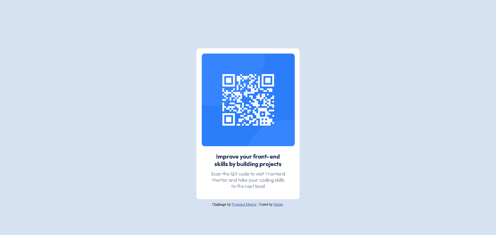

# Frontend Mentor - QR code component solution

This is a solution to the [QR code component challenge on Frontend Mentor](https://www.frontendmentor.io/challenges/qr-code-component-iux_sIO_H). Frontend Mentor challenges help you improve your coding skills by building realistic projects. 

## Table of contents

- [Overview](#overview)
  - [Screenshot](#screenshot)
  - [Links](#links)
- [My process](#my-process)
  - [Built with](#built-with)
  - [What I learned](#what-i-learned)
  - [Useful resources](#useful-resources)
- [Author](#author)

## Overview

### Screenshot

- Desktop design preview

- Mobile design preview

### Links

- Solution URL: [solution URL](https://www.frontendmentor.io/solutions/qr-code-component-using-html-and-css-0t_Qp5E4Gf)
- Live Site URL: [live site URL](https://marlar-tz.github.io/QR_Code_Component_Page/)

## My process

### Built with

- HTML
- CSS

### What I learned

In this challenge , I learnt about front face rule in order to use desired google font for HTML element.I added font file into the folder and pointed to that file in order to use that.

### Useful resources

- [font face rule](https://www.w3schools.com/cssref/css3_pr_font-face_rule.php) - This taught me about CSS @font-face Rule.

## Author

- Frontend Mentor - [@marlar](https://www.frontendmentor.io/profile/marlar-tz)

